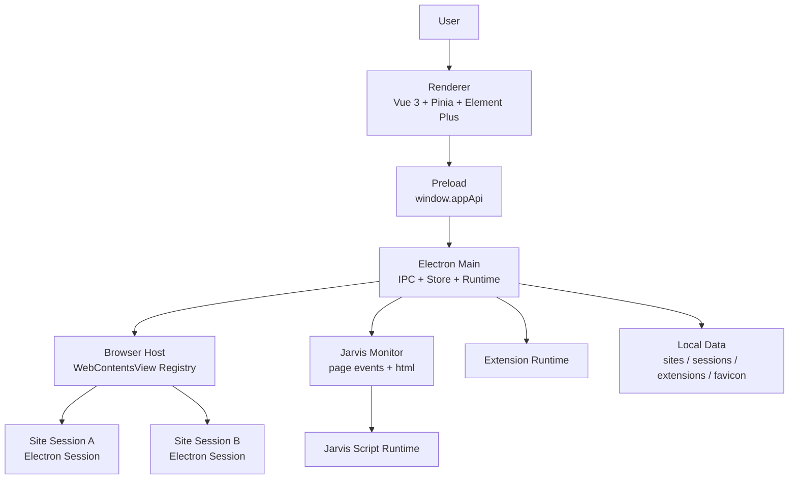

<div align="center">

<br/>

# Jarvis Browser

### Site-first Multi-session Browser

**为多账号、多站点、自动化脚本而生的 Electron 浏览器工作台**

<br/>


<br/>
<br/>

</div>

---

## Overview

**Jarvis Browser** 是一个围绕“站点”和“会话”组织的桌面浏览器。它不是把所有登录态塞进同一个浏览器上下文，而是让每个站点拥有多个彼此隔离的会话，用独立的 Electron Session 保存 Cookie、LocalStorage、IndexedDB、Cache 和 Service Worker 数据。

它适合长期维护多个账号、站点插件和 Jarvis Script 的工作流：打开一个站点，选择一个会话，浏览器会恢复对应的网页状态，并把脚本、扩展、favicon、标题等站点信息归档到本地。

> One site. Many sessions. Clean boundaries.

<br/>

## Features

### Site Workspace

- **站点优先**：起始页以站点卡片和快捷方式组织入口。
- **多会话管理**：同一站点可创建多个会话，用于区分账号、环境和任务上下文。
- **完整标签体验**：起始页固定为 Home 标签，站点会话以 Chrome 风格标签打开和切换。
- **会话标记**：工具栏显示当前会话名称，进入起始页时自动隐藏。

### Isolated Browser Runtime

- **独立登录态**：每个 `site + session` 使用独立 Electron Session 目录。
- **状态保留**：切换标签时保留 WebContentsView 实例和页面状态。
- **浏览器导航**：支持后退、前进、刷新、停止、地址栏导航。
- **错误页承载**：内置错误页通过自定义协议展示，地址栏仍保持目标网址。

### Jarvis Script

- **脚本管理面板**：当前站点可安装、启用、停用和卸载 Jarvis Script。
- **页面监控链路**：主进程 monitor 位于 WebContentsView 顶层，向脚本提供页面事件和页面 HTML。
- **站点元数据采集**：脚本可基于当前页面 HTML 解析 title、favicon 等信息。
- **面板互斥**：脚本、插件、会话和标签选择面板统一开关状态。

### Extension Runtime

- **Chrome 扩展目录安装**：支持安装已解压的扩展目录。
- **全局插件**：打开任意站点会话时加载。
- **站点插件**：只作用于指定站点的会话。
- **生命周期管理**：支持安装、启用、停用、卸载和加载错误展示。

### Local Data

- **本地持久化**：站点、会话、插件、下载和 favicon 元数据按目录保存。
- **favicon 缓存**：站点图标会写入本地缓存，起始页优先使用本地资源。
- **单实例运行**：应用全局只允许启动一个 Jarvis Browser 进程。

<br/>

## Architecture



### Tech Stack

| Layer | Technology |
|-------|------------|
| Desktop Shell | Electron |
| Browser View | WebContentsView |
| Renderer | Vue 3 + Vite + TypeScript |
| State | Pinia |
| UI | Element Plus + IconPark |
| Persistence | Local filesystem + Electron Session |
| Scripts | Jarvis Script runtime |
| Extensions | Chrome extension runtime |

<br/>

## Project Structure

```text
jarvis-browser/
├── src/
│   ├── main/
│   │   ├── browser-host/          # WebContentsView 生命周期、导航、状态同步
│   │   ├── browser-host/monitor/  # 顶层页面监控事件
│   │   ├── jarvis-script/         # Jarvis Script 管理与运行时
│   │   ├── extension-runtime.ts   # 全局插件和站点插件运行时
│   │   ├── favicon-cache.ts       # favicon 本地缓存
│   │   ├── store.ts               # 站点、会话、插件、下载元数据
│   │   └── main.ts                # Electron 主进程入口
│   │
│   ├── preload/
│   │   ├── preload.ts             # Renderer IPC 桥
│   │   └── error-page-preload.ts  # 内置错误页 IPC 桥
│   │
│   ├── renderer/
│   │   ├── components/            # 抽屉、插件管理、脚本管理、会话管理
│   │   ├── stores/                # Pinia browser store
│   │   ├── views/                 # 起始页与浏览器页
│   │   └── style.css              # 全局 Chrome 风格界面
│   │
│   ├── shared/
│   │   └── types.ts               # 主进程、preload、renderer 共用类型
│   │
│   └── internal-pages/
│       └── error.html             # 内置错误页
│
├── docs/                          # 实现计划与当前交接文档
├── package.json
├── tsconfig.json
├── tsconfig.electron.json
└── vite.config.ts
```

<br/>

## Data Layout

Jarvis Browser 的业务数据保存在本机用户数据目录下。每个站点有自己的元数据、favicon、插件和会话目录；每个会话再拥有独立的 Electron Session 数据。

```text
~/jarvis-browser/default/
  profile.json
  global/
    metadata.json
    downloads.json
    extensions/
      index.json
      installed/{extensionId}/
        manifest.json
        source/
  sites/
    index.json
    {siteId}/
      site.json
      favicon/
        favicon.{ext}
        metadata.json
      extensions/
        index.json
        installed/{extensionId}/
          manifest.json
          source/
      sessions/
        index.json
        {sessionId}/
          session.json
          electron-session/
          downloads/
```

<br/>

## Quick Start

### Prerequisites

- Node.js 20+
- npm 10+
- macOS / Windows / Linux desktop environment with Electron support

### Development

```bash
# 克隆项目
git clone https://github.com/jarvis-workbench/jarvis-browser.git
cd jarvis-browser

# 安装依赖
npm install

# 启动开发环境
npm run dev
```

开发模式会同时启动：

| Process | Command | Description |
|---------|---------|-------------|
| Renderer | `vite --host 127.0.0.1` | Vue 前端开发服务 |
| Main | `tsc -p tsconfig.electron.json --watch` | Electron 主进程编译 |
| Electron | `electron .` | 桌面应用 |

### Validation

```bash
npm run typecheck
```

当前项目以开发运行验证为主，不默认执行打包流程。

<br/>

## Core Concepts

| Concept | Meaning |
|---------|---------|
| Site | 一个长期维护的站点入口，例如 ChatGPT、Gmail、Douyin |
| Session | 一个站点下的独立账号/上下文 |
| WebContentsView | 一个正在运行的真实网页视图 |
| Jarvis Monitor | 主进程顶层页面监控器，负责向脚本提供页面事件和 HTML |
| Jarvis Script | 面向站点的自动化脚本 |
| Global Extension | 所有站点会话都会加载的扩展 |
| Site Extension | 只在指定站点会话中加载的扩展 |

<br/>

## Repository

- GitHub: [jarvis-workbench/jarvis-browser](https://github.com/jarvis-workbench/jarvis-browser)
- Organization: [jarvis-workbench](https://github.com/jarvis-workbench)

<br/>

## License

No license has been published yet.

<br/>

---

<div align="center">

**Jarvis Browser** — A focused browser workspace for sessions, scripts, and automation.

<sub>Built with Electron · Vue 3 · TypeScript · Pinia · Element Plus</sub>

</div>
