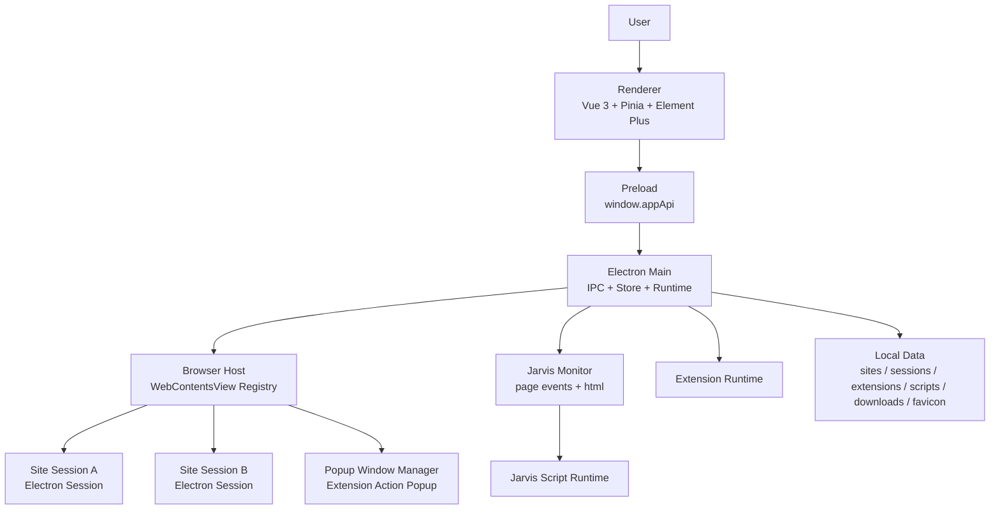

<div align="center">

<br/>

# Jarvis Browser

### Site-first Multi-session Browser

**为多账号、多站点、自动化脚本而生的 Electron 浏览器工作台**

<br/>


<br/>
<br/>

</div>

---

## Overview

**Jarvis Browser** 是一个围绕“站点”和“会话”组织的桌面浏览器。它不是把所有登录态塞进同一个浏览器上下文，而是让每个站点拥有多个彼此隔离的会话，用独立的 Electron Session 保存 Cookie、LocalStorage、IndexedDB、Cache 和 Service Worker 数据。

它适合长期维护多个账号、站点扩展程序和 Jarvis Script 的工作流：打开一个站点，先选择要使用的会话，浏览器会恢复对应的网页状态，并把脚本、扩展、favicon、标题、下载记录等工作台数据归档到本地。

> One site. Many sessions. Clean boundaries.

<br/>

## Features

### Site Workspace

- **站点优先**：起始页以站点卡片和快捷方式组织入口。
- **多会话管理**：同一站点可创建多个会话，用于区分账号、环境和任务上下文。
- **打开前选择会话**：起始页的站点卡片和快捷图标会先列出该站点的所有会话，选择后再打开。
- **完整标签体验**：起始页固定为 Home 标签，站点会话以 Chrome 风格标签打开和切换。
- **会话标记**：工具栏显示当前会话名称，进入起始页时自动隐藏。
- **内置工作页**：下载内容和设置作为内部标签页打开，不占用站点会话。

### Isolated Browser Runtime

- **独立登录态**：每个 `site + session` 使用独立 Electron Session 目录。
- **状态保留**：切换标签时保留 WebContentsView 实例和页面状态。
- **浏览器导航**：支持后退、前进、刷新、停止、地址栏导航。
- **错误页承载**：内置错误页通过自定义协议展示，地址栏仍保持目标网址。
- **持久会话分区**：每个会话使用 `persist:site-{siteId}-session-{sessionId}`，登录态由 Electron 原生持久 session 保存。

### Jarvis Script

- **脚本管理面板**：当前站点可安装、启用、停用和卸载 Jarvis Script。
- **页面监控链路**：主进程 monitor 位于 WebContentsView 顶层，向脚本提供页面事件和页面 HTML。
- **站点元数据采集**：脚本基于当前页面 HTML 解析 title、favicon 等信息。
- **favicon 生命周期保护**：站点图标只在站点尚无图标时首次采集，后续跳转不会把外部站点图标写回当前站点。
- **面板互斥**：脚本、扩展程序、会话和标签选择面板统一开关状态。

### Extension Runtime

- **Chrome 扩展目录安装**：支持安装已解压的扩展目录。
- **全局扩展程序**：打开任意站点会话时加载。
- **站点扩展程序**：只作用于指定站点的会话。
- **生命周期管理**：支持安装、启用、停用、卸载和加载错误展示。
- **Chrome 风格 popup**：带 `action.default_popup` 的扩展会在工具栏显示 action 图标，点击后由主进程创建独立 `BrowserWindow` 浮层承载真实 `chrome-extension://...` 页面。
- **登录态迁移桥接**：Jarvis 扩展 popup 可通过专用 preload 调用当前会话的 Electron `session.cookies`，用于补齐 Electron 扩展运行时缺失的 `chrome.cookies` 写入能力。

### Local Data

- **本地持久化**：站点、会话、扩展程序、下载和 favicon 元数据按目录保存。
- **favicon 缓存**：站点图标会写入本地缓存，起始页优先使用本地资源。
- **下载管理**：下载记录、下载位置和“每次下载前询问保存位置”配置持久保存。
- **单实例运行**：应用全局只允许启动一个 Jarvis Browser 进程。

<br/>

## Architecture



### Tech Stack

| Layer | Technology |
|-------|------------|
| Desktop Shell | Electron |
| Browser View | WebContentsView |
| Renderer | Vue 3 + Vite + TypeScript |
| State | Pinia |
| UI | Element Plus + IconPark |
| Persistence | Local filesystem + Electron Session |
| Scripts | Jarvis Script runtime |
| Extensions | Chrome extension runtime |

<br/>

## Project Structure

```text
jarvis-browser/
├── src/
│   ├── main/
│   │   ├── browser-host/          # WebContentsView 生命周期、导航、状态同步
│   │   ├── browser-host/monitor/  # 顶层页面监控事件
│   │   ├── jarvis-script/         # Jarvis Script 管理与运行时
│   │   ├── extension-runtime.ts   # 全局扩展程序和站点扩展程序运行时
│   │   ├── browser-overlay-host.ts # 主进程浮层宿主，承载扩展 action popup
│   │   ├── internal-protocol.ts   # jarvis-browser:// 内部页面协议
│   │   ├── favicon-cache.ts       # favicon 本地缓存
│   │   ├── store.ts               # 站点、会话、扩展程序、下载元数据
│   │   ├── history-manager.ts     # 浏览历史
│   │   ├── storage-manager.ts     # 存储统计与清理
│   │   └── main.ts                # Electron 主进程入口
│   │
│   ├── preload/
│   │   ├── preload.ts                 # Browser shell IPC 桥
│   │   ├── web-page-preload.ts        # WebContentsView 页面桥
│   │   └── extension-popup-preload.ts # 扩展 popup IPC 桥
│   │
│   ├── renderer/
│   │   ├── components/            # 抽屉、扩展程序管理、脚本管理、会话管理
│   │   ├── stores/                # Pinia browser store
│   │   ├── views/                 # 起始页、浏览器页、下载页、设置页
│   │   ├── public/                # Renderer 静态资源
│   │   └── style.css              # 全局基础样式和浏览器外壳样式
│   │
│   ├── shared/
│   │   └── types.ts               # 主进程、preload、renderer 共用类型
│   │
│   └── internal-pages/
│       └── error.html             # 内置错误页
│
├── package.json
├── tsconfig.json
├── tsconfig.electron.json
└── vite.config.ts
```

<br/>

## Data Layout

Jarvis Browser 的业务数据保存在本机用户数据目录下。每个站点有自己的元数据、favicon、扩展程序和会话目录；每个会话再拥有独立的 Electron Session 数据。

```text
~/jarvis-browser/default/
  profile.json
  global/
    metadata.json
    downloads.json
    extensions/
      index.json
      installed/{extensionId}/
        manifest.json
        source/
    jarvis-scripts/
      index.json
      installed/{scriptId}/
        manifest.json
        source/
        data/
  sites/
    index.json
    {siteId}/
      site.json
      favicon/
        favicon.{ext}
        metadata.json
      extensions/
        index.json
        installed/{extensionId}/
          manifest.json
          source/
      jarvis-scripts/
        index.json
        installed/{scriptId}/
          manifest.json
          source/
          data/
      sessions/
        index.json
        {sessionId}/
          session.json
          downloads/
  runtime/
    user-data/
    session-data/
      Partitions/
```

会话登录态由 Electron 持久分区保存，分区名称为：

```text
persist:site-{siteId}-session-{sessionId}
```

<br/>

## Download

Jarvis Browser provides preview builds on GitHub Releases:

- [Latest release](https://github.com/jarvis-workbench/jarvis-browser/releases/latest)
- [macOS Apple Silicon](https://github.com/jarvis-workbench/jarvis-browser/releases/download/v0.1.0/Jarvis-Browser-0.1.0-mac-arm64.dmg)
- [macOS Intel](https://github.com/jarvis-workbench/jarvis-browser/releases/download/v0.1.0/Jarvis-Browser-0.1.0-mac-x64.dmg)
- [Windows x64](https://github.com/jarvis-workbench/jarvis-browser/releases/download/v0.1.0/Jarvis-Browser-0.1.0-win-x64-setup.exe)

The current release is an unsigned preview build. macOS or Windows may show a security warning during installation or first launch.

<br/>

## Development

### Prerequisites

- Node.js 20+
- npm 10+
- macOS / Windows / Linux desktop environment with Electron support

### Run Locally

```bash
# 克隆项目
git clone https://github.com/jarvis-workbench/jarvis-browser.git
cd jarvis-browser

# 安装依赖
npm install

# 启动开发环境
npm run dev
```

开发模式会同时启动：

| Process | Command | Description |
|---------|---------|-------------|
| Renderer | `vite --host 127.0.0.1` | Vue 前端开发服务 |
| Main | `tsc -p tsconfig.electron.json --watch` | Electron 主进程编译 |
| Electron | `electron .` | 桌面应用 |

### Validation

```bash
npm run typecheck
```

当前项目以开发运行验证为主，不默认执行打包流程。

### Local Automation Bridge

Jarvis Browser includes a local automation bridge for inspecting and controlling the active `BrowserView` from local tools or coding agents. It is useful when debugging site extensions, Jarvis Script, Telegram media downloading, or page-specific automation without manually pasting code into DevTools.

The bridge is disabled by default.

To enable it:

1. Open `jarvis-browser://settings`.
2. Find **本机自动化桥**.
3. Turn it on.
4. Copy the local origin and token shown in Settings.

The bridge only listens on `127.0.0.1` and every request must include the token:

```bash
export JARVIS_AUTOMATION_ORIGIN="http://127.0.0.1:17361"
export JARVIS_AUTOMATION_TOKEN="<token from settings>"

curl -H "Authorization: Bearer $JARVIS_AUTOMATION_TOKEN" \
  "$JARVIS_AUTOMATION_ORIGIN/state"
```

Common endpoints:

| Endpoint | Method | Purpose |
|----------|--------|---------|
| `/status` | `GET` | Bridge status, origin, port, token metadata |
| `/state` | `GET` | Active tab and all open BrowserView-backed tabs |
| `/tabs` | `GET` | Tab list only |
| `/dom/query` | `POST` | Query DOM elements in the active or specified tab |
| `/dom/snapshot` | `POST` | Return a bounded DOM tree snapshot |
| `/eval` | `POST` | Execute JavaScript in the page context |
| `/tg` | `POST` | Invoke the Telegram downloader content-script automation hook |

Examples:

```bash
# Query page elements.
curl -H "Authorization: Bearer $JARVIS_AUTOMATION_TOKEN" \
  -H "content-type: application/json" \
  -d '{"selector":"video,.media-container","limit":20}' \
  "$JARVIS_AUTOMATION_ORIGIN/dom/query"

# Evaluate an expression in the active BrowserView.
curl -H "Authorization: Bearer $JARVIS_AUTOMATION_TOKEN" \
  -H "content-type: application/json" \
  -d '{"code":"document.title"}' \
  "$JARVIS_AUTOMATION_ORIGIN/eval"

# Run a Telegram downloader scan through the installed content script.
curl -H "Authorization: Bearer $JARVIS_AUTOMATION_TOKEN" \
  -H "content-type: application/json" \
  -d '{"action":"scan"}' \
  "$JARVIS_AUTOMATION_ORIGIN/tg"
```

`/eval`, `/dom/query`, `/dom/snapshot`, and `/tg` accept an optional `tabId` field. If omitted, the active Jarvis tab is used.

### Release and Updates

Application updates are delivered through GitHub Releases. Packaged macOS and Windows builds can check for updates from `jarvis-browser://settings`; development mode does not perform real update checks.

The update flow is user-confirmed:

- Check for updates in Settings.
- If a new version is available, click **Update** to download it.
- After the download finishes, click **Restart to install**.

Maintainer releases are built by GitHub Actions. Pushing a `v*` tag runs validation, builds macOS and Windows packages, and publishes the release assets:

```bash
git tag v0.1.1
git push origin v0.1.1
```

The project currently publishes unsigned preview builds. Signing and notarization can be added later when the distribution channel is ready for a signed release.

<br/>

## Core Concepts

| Concept | Meaning |
|---------|---------|
| Site | 一个长期维护的站点入口，例如 ChatGPT、Gmail、Douyin |
| Session | 一个站点下的独立账号/上下文 |
| WebContentsView | 一个正在运行的真实网页视图 |
| Jarvis Monitor | 主进程顶层页面监控器，负责向脚本提供页面事件和 HTML |
| Jarvis Script | 面向站点的自动化脚本 |
| Global Extension | 所有站点会话都会加载的扩展 |
| Site Extension | 只在指定站点会话中加载的扩展 |
| Extension Popup | 由独立 BrowserWindow 承载的扩展 action 面板 |
| Internal Page | Jarvis Browser 自身的下载、设置等工作台页面 |

<br/>

## Repository

- GitHub: [jarvis-workbench/jarvis-browser](https://github.com/jarvis-workbench/jarvis-browser)
- Organization: [jarvis-workbench](https://github.com/jarvis-workbench)

<br/>

## License

No license has been published yet.

<br/>

---

<div align="center">

**Jarvis Browser** — A focused browser workspace for sessions, scripts, and automation.

<sub>Built with Electron · Vue 3 · TypeScript · Pinia · Element Plus</sub>

</div>
